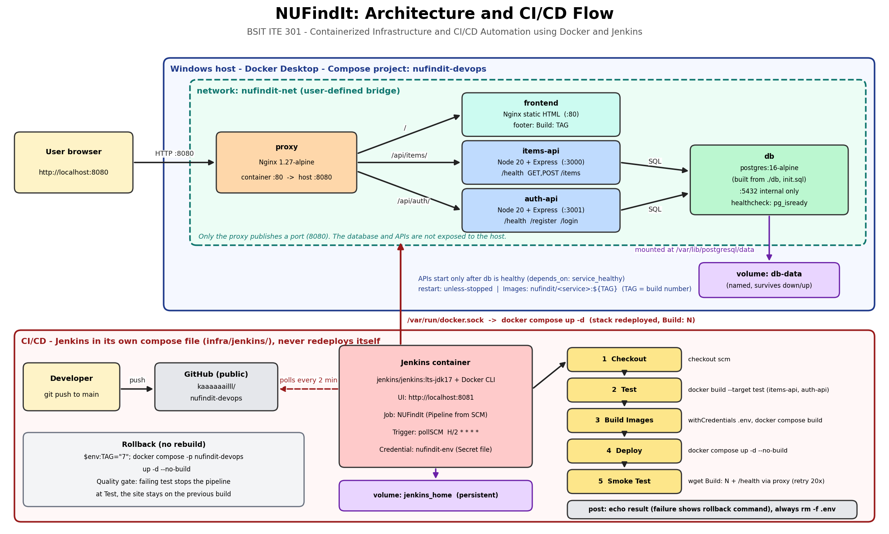

## 3. Architecture

*Figure 1. NUFindIt system architecture.*

**How a request flows.** The browser talks only to the Nginx proxy on port 8080. The proxy decides where to send the request by its URL path:

- `/` goes to the frontend container, which serves the static page.
- `/api/items/` goes to items-api (port 3000).
- `/api/auth/` goes to auth-api (port 3001).

Both APIs read and write data in the PostgreSQL container (db) over the private network `nufindit-net`. Nothing except the proxy publishes a port to the host, so the APIs and the database cannot be reached directly from outside.

**Why this design.**

- **One entry point.** The proxy hides the internal services, gives the browser a single origin (no CORS problems), and makes it easy to add or replace modules.
- **One container per module.** Each module has its own image, so it can be built, tested, restarted, and rolled back independently.
- **Data outside the container.** The database files live in the named volume `db-data`, not in the container. Containers can be destroyed and recreated on every deploy while the data stays.
- **Startup order.** `depends_on` with `condition: service_healthy` makes the APIs wait until PostgreSQL passes its health check.

**CI/CD flow.** A developer pushes to the `main` branch on GitHub. Jenkins (running in its own container) detects the new commit by polling, runs the tests, builds the images tagged with the build number, redeploys the Compose stack, and finishes with a smoke test through the proxy. Details are in sections 7 and 8.

## 4. Technology Stack

| Layer | Technology | Justification |
|---|---|---|
| Containers | Docker (Docker Desktop on Windows) | Required by the project. Packages each module with its dependencies so it runs the same on every team member's laptop and in Jenkins. |
| Orchestration | Docker Compose v2 | Describes all five services, the network, the volume, health checks, and start order in one file. Simple and enough for a single-host deployment. |
| Reverse proxy | Nginx 1.27-alpine | Lightweight, widely used, and simple path-based routing. Alpine keeps the image small. Pinned version, not `latest`. |
| Frontend | Static HTML served by Nginx 1.27-alpine | The app is not the grading focus, so a static page keeps the module small. It also lets the build number be injected at build time and shown in the footer. |
| Backend runtime | Node.js 20 (alpine) + Express | Fast to develop, small images, and the team already knows JavaScript. Node 20 is an LTS release. |
| Database driver | pg | The standard PostgreSQL client for Node. |
| Authentication | bcryptjs + jsonwebtoken | bcryptjs hashes passwords (pure JavaScript, no native build step in alpine). JWT gives stateless login tokens. |
| Database | PostgreSQL 16-alpine | Reliable relational database with an official image and a built-in `pg_isready` check used for the health check. |
| Testing | Jest | Simple test runner for Node. Runs inside the Docker `test` stage, so the same tests run on every laptop and in Jenkins. |
| CI/CD server | Jenkins LTS (jenkins/jenkins:lts-jdk17) | Required by the project. Declarative pipelines stored in the repository (Jenkinsfile). |
| Pipeline trigger | Poll SCM, `H/2 * * * *` | Jenkins runs on a laptop without a public address, so GitHub cannot call a webhook. Polling every 2 minutes needs no extra tool. |
| Source control | Git + GitHub (public repository) | Shared history for the whole team, and the instructor can access it. |
| Secrets | Jenkins "Secret file" credential (`nufindit-env`) + git-ignored `.env` | Passwords and the JWT secret never enter the repository. Only `.env.example` is committed. |
| Developer tools | VS Code with PowerShell terminal | What the team used day to day. |
