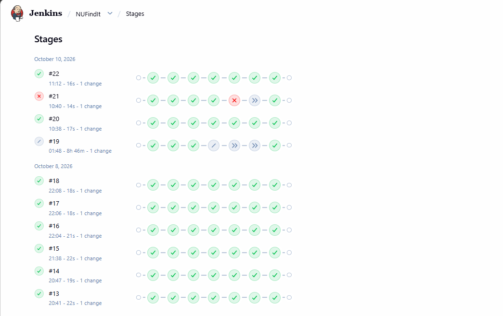
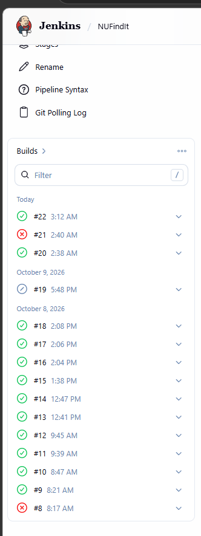

# 7. Jenkins Setup

## 7.1 How Jenkins was installed
Jenkins runs in its own container, defined in a separate compose file (infra/jenkins/docker-compose.yml). It is kept apart from the application stack so the pipeline never redeploys Jenkins itself. The two stacks use different networks (jenkins_default and nufindit-net) and different project names.

Start command: `cd infra/jenkins` then `docker compose up -d --build`. The web UI is at http://localhost:8081 (host port 8081 maps to container port 8080).

## 7.2 Custom Jenkins image (infra/jenkins/Dockerfile)
| Step | What it does | Why |
|---|---|---|
| FROM jenkins/jenkins:lts-jdk17 | Official Jenkins long-term-support image with Java 17 | Stable, supported base |
| USER root | Switches to root for installation | Needed to install packages |
| apt-get install ca-certificates curl gnupg | Tools to download and verify the Docker repository key | Secure package source |
| Add Docker apt repository | Registers download.docker.com with a signed key | Official Docker packages |
| apt-get install docker-ce-cli docker-compose-plugin | Installs only the Docker client and the compose plugin (no Docker engine) | Jenkins sends commands to the host's Docker |
| rm -rf /var/lib/apt/lists/* | Deletes the apt cache | Smaller image |
| USER jenkins | Returns to the jenkins user | Plugin install runs as jenkins |
| jenkins-plugin-cli --plugins ... | Pre-installs the plugins at build time | Avoids dependency errors from the setup wizard |

## 7.3 Plugins
Installed in the image with jenkins-plugin-cli: git, workflow-aggregator (Pipeline), docker-workflow (Docker Pipeline), credentials-binding, plain-credentials, timestamper. In the setup wizard we chose "None" for suggested plugins.

## 7.4 Container configuration (infra/jenkins/docker-compose.yml)
- `build: .` builds the custom image above.
- `container_name: jenkins`, `restart: unless-stopped` so Jenkins comes back after a Docker or laptop restart.
- `ports`: 8081 to 8080 (web UI) and 50000 (agent port).
- `volumes`: the named volume jenkins_home mounted at /var/jenkins_home (project name jenkins gives the volume name jenkins_jenkins_home), so jobs, credentials and build history survive restarts and rebuilds.
- `/var/run/docker.sock` is mounted, and the container runs as `user: root`, so Jenkins can run docker and docker compose against the host's Docker.

## 7.5 Credentials
One credential of type **Secret file** with ID `nufindit-env`. It holds the production .env (DB_NAME, DB_USER, DB_PASSWORD, JWT_SECRET, TAG). The Jenkinsfile reads it with withCredentials, copies it to .env for the build, and deletes it afterwards. No secret is in Git or in the Jenkinsfile. Only .env.example, with placeholder values, is committed.

## 7.6 Job configuration
Job name NUFindIt, type Pipeline, definition "Pipeline script from SCM", SCM Git, repository https://github.com/kaaaaaailll/nufindit-devops, branch */main, Script Path Jenkinsfile. The pipeline is stored in the repository (pipeline as code), not in the Jenkins UI.

## 7.7 Trigger configuration
The Jenkinsfile contains `triggers { pollSCM('H/2 * * * *') }`. Jenkins asks GitHub for changes about every 2 minutes (the H spreads the exact minute to avoid load spikes). If there is a new commit on main, a build starts with no manual action. A webhook would be faster, but it needs a public URL (for example ngrok), and Jenkins here runs on a laptop. Poll SCM works on any network. The Git Polling Log page in Jenkins shows each check.

## 7.8 Security note
Mounting the Docker socket and running as root gives Jenkins full control of the host's Docker. That is acceptable in a lab but not in production, because anyone who can change a Jenkinsfile can start privileged containers. Safer alternatives: dedicated build agents, rootless Docker, Docker-in-Docker with TLS, and Kaniko for building images without a Docker daemon.

# 8. Pipeline Explanation

## 8.1 Pipeline settings
- agent any: runs on the Jenkins controller, which has the Docker CLI.
- environment: COMPOSE_PROJECT_NAME = nufindit-devops (so every build manages the same stack) and TAG = BUILD_NUMBER (images are tagged nufindit/<service>:<build number>).
- options: timestamps (time on every log line), disableConcurrentBuilds (no two deployments at once), buildDiscarder keeping the last 15 builds.
- triggers: pollSCM every 2 minutes.

## 8.2 Stages
| Stage | What it does | On failure |
|---|---|---|
| Checkout | checkout scm pulls the repository, then prints the latest commit with git log -1 --oneline | Pipeline stops, nothing changes |
| Test | docker build --target test for items-api and auth-api. The test stage of each Dockerfile runs the Jest tests | Build fails here. Build Images, Deploy and Smoke Test are skipped, so the running site keeps the previous version |
| Build Images | Loads the nufindit-env secret file as .env, then runs docker compose build. Images get the build number tag | Stops before Deploy. The old containers keep running |
| Deploy | docker compose up -d --no-build --remove-orphans replaces the containers with the new images. If the command fails, it waits 10 seconds and runs it once more (see 8.5). The db-data volume is kept | If the retry also fails, the stage fails and the post section prints the rollback command |
| Smoke Test | Up to 20 tries, 5 seconds apart. Inside the proxy container it fetches http://127.0.0.1/ and checks that the page contains "Build: <TAG>", then calls /api/items/health and /api/auth/health | After 20 tries it prints "Smoke test failed" and exits 1 |

Note: the smoke test uses 127.0.0.1 and not localhost. wget resolved localhost to IPv6, while nginx listens on IPv4 only, which caused "Connection refused".

## 8.3 Post actions
- success: prints "NUFindIt build <TAG> is live at http://127.0.0.1:8080".
- failure: prints that the build failed and the rollback command `TAG=<previous> docker compose -p nufindit-devops up -d --no-build`.
- always: `rm -f .env`, so the secret file never stays in the workspace.

## 8.4 Proof of the pipeline
| Build | Event | Result |
|---|---|---|
| #1 to #5 | Setup problems (plugins, credential ID, container name conflict, IPv6) | Failed |
| #6 | First complete run | Passed |
| #7 | Pushed a heading change "(v2)" | Started automatically by Poll SCM. Footer showed Build: 7. Earlier items still listed |
| #8 | Pushed a deliberately failing test (items-api/tests/break.test.js) | Failed at Test. Deploy skipped. Site stayed on Build 7 |
| #9 | Removed the failing test | Passed. Footer showed Build: 9 |
| #10 to #18 | Later pushes (README, diagram, docs and fixes) | Passed |
| #19 | Build started while the laptop was asleep | Hung for almost 9 hours. Aborted |
| #20 | Build triggered again | Passed |
| #21 | Deploy stage hit "removal of container already in progress" | Failed at Deploy |
| #22 | After adding the retry to the Deploy stage | Passed. Rollback to build 18 and back to 22 tested |
| #23 | Push of the technical documentation (docs only) | Started automatically by Poll SCM. Passed |

## 8.5 Deploy retry
Build #21 failed at Deploy with "removal of container ... already in progress". Docker was still removing the old container when Compose tried to recreate it. The Deploy stage is now:

`docker compose up -d --no-build --remove-orphans || { echo "Deploy retry after 10s"; sleep 10; docker compose up -d --no-build --remove-orphans; }`

If the first attempt succeeds, nothing changes. If it fails, the stage waits 10 seconds and tries once more. A real failure still fails the stage on the second attempt. Build #22 passed with this change.

## 8.6 Build #19 (laptop sleep)
Build #19 hung for almost 9 hours because the laptop went to sleep during the run. We aborted it and ran the pipeline again (#20). Windows sleep is turned off before demos.

Note: Jenkins keeps only the last 15 builds (buildDiscarder). Builds #8 and #9 were removed from the Stages page later, but the build list screenshot above was taken while they were still shown.
