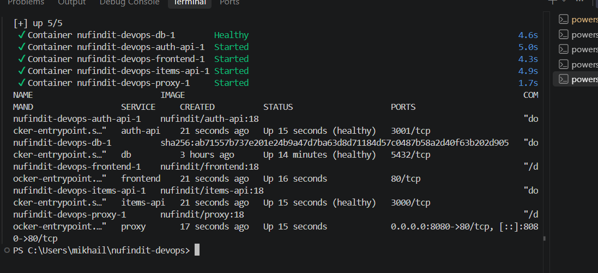
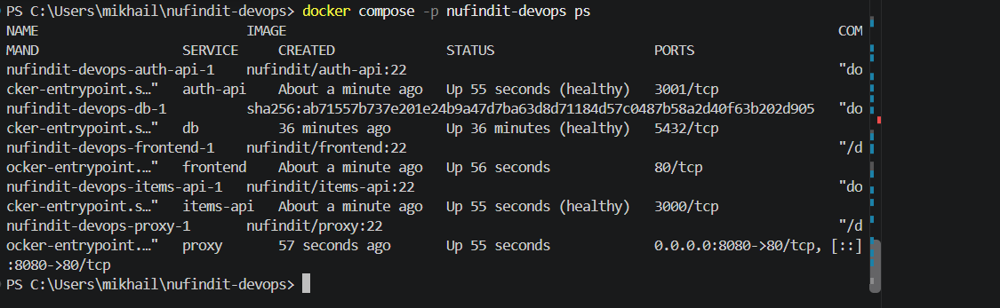
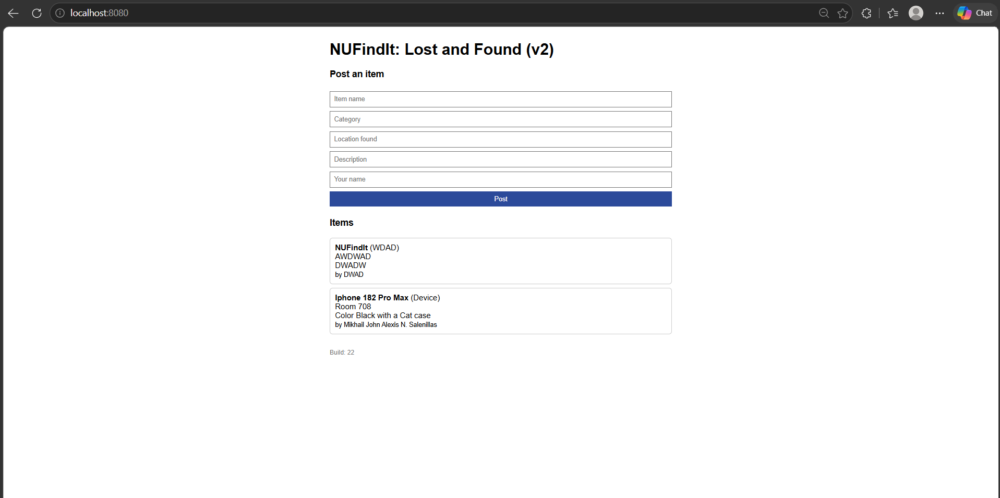
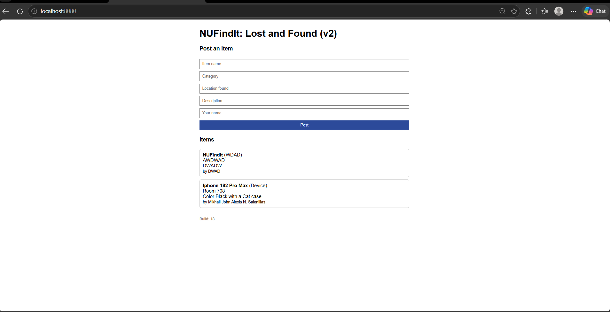

# 10. Rollback Procedure and Data Persistence Proof

## 10.1 Why rollback works
Jenkins sets TAG to the build number, so every deployment creates images named nufindit/<service>:<build number>. Older images stay on the machine. To roll back, we start the stack again with an older TAG and the --no-build option, so Docker reuses the existing images and builds nothing.

## 10.2 Rollback procedure
1. Check that the old images exist: `docker images` and look for the tag, for example 18.
2. Run the rollback:

`$env:TAG="18"; docker compose -p nufindit-devops up -d --no-build`

3. Docker recreates proxy, frontend, items-api and auth-api from the :18 images. The db container is not touched.
4. Open http://localhost:8080. The footer shows "Build: 18".
5. To return to the latest version, run the same command with the newest build number, for example `$env:TAG="22"`.

Note: the rollback changes the application services only. The db image has no build tag, and the data stays in the db-data volume.

**Proof:** we rolled back from build 22 to build 18. All four application containers were recreated with :18 images and the db container stayed up. We then returned to build 22.

## 10.3 Current state of the stack
All five containers are running and healthy on build 22. The only published port is 8080 on the proxy.

## 10.4 Data persistence proof
The database files live in the named volume db-data, not inside the container. We tested persistence in three ways, without ever using the -v option:
- Redeployment by Jenkins: items posted earlier were still listed after every new build (#7, #9, #22).
- Restart: `docker compose -p nufindit-devops down` followed by `docker compose -p nufindit-devops up -d` kept all items.
- Rollback: the db container was not recreated, so its data was untouched.

## 10.5 Pipeline history
The Jenkins build list and Stage View show the failed build #8 (quality gate) followed by green builds.

